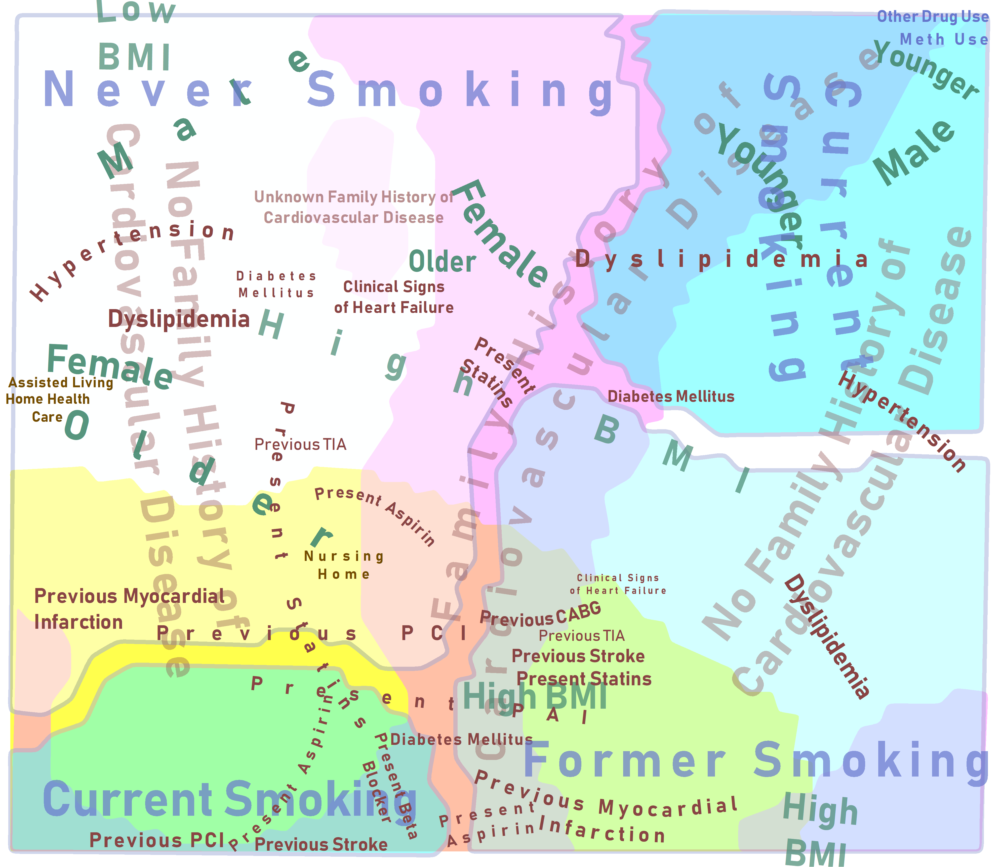

# STEMI-public
# Machine Learning for Holistic Visualization of STEMI Registry Data

by
Keshav R. Nayak,
André Skupin,
Timothy Schempp,
Ross Garberich,
Sanjeev P. Bhavnani,
and Timothy Henry.

This paper has been submitted for review in *Journal of the American Medical Informatics Association*.

> Combining cartographic mapping techniques and artificial neural networks permitted the transformation of the STEMI database into novel, two-dimensional visualizations of patient characteristics and outcomes.

*Composite Visualization of Multivariate Patient Space. Labeling encodes variable category (font color) and the magnitude and shape of area coverage (font size and text placement). Dominant variables explicitly delineated as areas: Family History of CVD (magenta), Current Smoking (cyan), Former Smoking (light cyan), and Previous History of CVD (yellow).*

## Getting the Project Files

You can download a copy of all the files in this repository by cloning the
[git](https://git-scm.com/) repository:

    git clone https://github.com/CICS-SDSU/STEMI-public.git

or [download a zip archive](https://github.com/CICS-SDSU/STEMI-public/archive/refs/heads/main.zip).

## Required Software

[ArcMap Version 10.8](https://desktop.arcgis.com/en/arcmap/) to open the MXD project files.

[QGIS](https://qgis.org/en/site/) can be used to open the data (shapefile format) but users will have to manually stylize the attributes of interest.